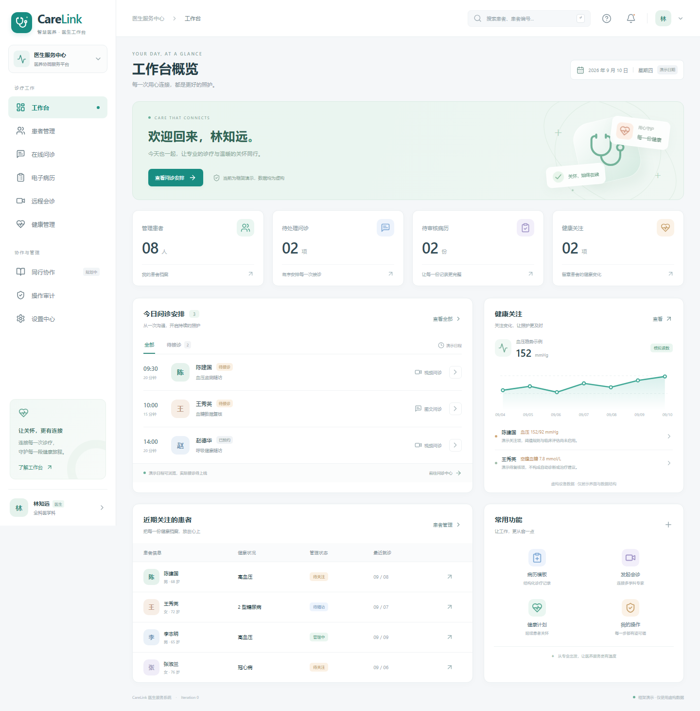

# CareLink Doctor Service System

CareLink is an installable Windows desktop application for the doctor side of the Smart Medical and Elderly Care Big Data Public Service Platform. Version 0.2.0 delivers the Iteration 0 framework: a light medical workspace, Chinese and English interface switching, synthetic patient data, a local database, versioned service contracts and independently owned modules for a five-person team.

**Current scope: framework demonstration using fictional records.** Patient search, filters, read-only details, health charts, navigation, audit browsing and local preferences are available. Identity verification, clinical writes, prescriptions, live consultation, recording, notifications, uploads and exports remain clearly marked as planned. Reserved service commands return `501 FEATURE_NOT_IMPLEMENTED`.



[Preview the English interface](docs/images/dashboard-en.png).

## Install and run on Windows

Download the [Windows installer](https://github.com/Kevin-deb/Industrial-Team-Project/releases/download/v0.2.0/CareLink-Doctor-0.2.0-Windows-x64-Setup.exe) from [release 0.2.0](https://github.com/Kevin-deb/Industrial-Team-Project/releases/tag/v0.2.0), which also provides its SHA-256 checksum. Use **CareLink-Doctor-0.2.0-Windows-x64-Setup.exe** on Windows 10 or 11, x64. Complete setup, then open **CareLink Doctor** from the Start menu or desktop shortcut. The application includes its runtime and opens in its own desktop window. End users do not need Node.js, npm, a database server or a separate browser.

The interface starts in Simplified Chinese. Use the language control in the top bar or Settings to select **English** or **简体中文**. The interface changes immediately, and the choice is retained after restarting the application.

After installation, the synthetic local demonstration works offline. Future hospital/device, identity, video and messaging providers will require network access when enabled. The local database belongs to the Windows user's application-data folder, separately from the installation directory. See [Desktop guide](docs/DESKTOP_GUIDE.md) for installation, data locations, uninstall behavior and development builds. Installer artifacts are generated release outputs, not source files to commit to Git.

The current installer is unsigned unless a later release explicitly supplies a verified signature. Check the publisher/source and supplied checksum before running the package; signing and update distribution remain release-engineering work.

## Develop from source

Developers need **Node.js 24.14.0 or later within the 24.x line**, npm and internet access for the initial dependency/runtime download. Open PowerShell in this repository:

```powershell
npm ci
npm run build
npm start
```

`npm start` launches the already-built desktop application. `npm run dev` builds all application parts and then opens the desktop application. To package the Windows application:

```powershell
npm run package:dir
npm run package:win
```

The first command produces an unpacked application for inspection; the second produces the NSIS installer. Output is written under `release/`. The renderer, embedded API and Electron runtime are bundled in the application. Normal desktop use starts no HTTP listener and needs no localhost URL.

`npm run dev:web` is optional browser tooling for frontend developers. It starts Vite at `http://127.0.0.1:5173` with an API at `127.0.0.1:3001`. It is a development aid, not the installation or launch procedure for users. See the desktop guide before changing ports or data paths.

## Documentation

| Document                                                       | Purpose                                                           |
| -------------------------------------------------------------- | ----------------------------------------------------------------- |
| [Desktop guide](docs/DESKTOP_GUIDE.md)                         | Windows installation, launch, languages, local data and packaging |
| [Delivery status](docs/DELIVERY_STATUS.md)                     | Implemented framework, deferred functions and verified results    |
| [Iteration plan](docs/ITERATION_PLAN.md)                       | English plan, five-person ownership and acceptance gates          |
| [Architecture](docs/ARCHITECTURE.md)                           | Desktop processes, service boundaries, data and extension points  |
| [API conventions](docs/API_CONVENTIONS.md)                     | Internal protocol, DTOs, compatibility and reserved operations    |
| [Requirements traceability](docs/REQUIREMENTS_TRACEABILITY.md) | Source requirements and latest desktop/language correction        |
| [Team workflow](docs/TEAM_WORKFLOW.md)                         | Parallel development, module ownership and review rules           |

Updated architecture presentations: [English v3](docs/presentations/Doctor_Service_System_Requirements_and_Architecture_EN_v3_Desktop.pptx) and [Chinese v3](docs/presentations/医生服务系统_需求分析与架构设计_中文版_v3_桌面版.pptx). Both reflect the Windows desktop runtime, persistent language switch and five-person iteration plan. Copies are also available in the parent workspace's `output` folder.

The original requirement files in the parent workspace's `docs` folder and the previous v2 decks remain historical inputs. The latest instruction and current v3 design establish an installable Windows desktop application with a persistent Chinese/English switch as the delivery format.

## Repository layout

```text
apps/desktop/          Electron main process, private protocol and Windows packaging
apps/web/              React desktop renderer and optional browser development tooling
  src/dashboard/       Read-only work overview
  src/modules/         Owned domain pages
  src/shared/          UI primitives and service client
apps/api/              Embedded Fastify business services
  src/platform/        Identity/policy/audit foundation and shared composition
  src/patients/        Patient domain
  src/encounters/      Online encounters and expert consultations
  src/clinical/        Records, review and orders
  src/health/          Observations, plans and reminders
  src/social/          Isolated optional community scaffold
  src/database/        Migration composition and SQLite connection
packages/contracts/    Shared DTOs and integration ports
README.md              Installation and contributor entry point
docs/                  English guides, plan and inactive CI template
scripts/               Build and repository verification helpers
tests/                 Integration checks
release/               Generated Windows artifacts, excluded from Git
```

## Verification

```powershell
npm run check
npm run test:desktop
npm run package:win
```

`check` validates source boundaries, TypeScript, API/desktop-protocol tests and all application builds. `test:desktop` runs native Electron integration checks on Windows, including both interface languages. `test:e2e` remains an optional browser-development suite; it does not substitute for desktop tests. Packaging verifies that an installer can be produced; it does not by itself prove installation or clinical readiness. Exact completed checks are recorded in [Delivery status](docs/DELIVERY_STATUS.md).

`npm run format:check` checks formatting and `npm run format` applies it. The [CI template](docs/ci/README.md) separates Windows desktop testing/packaging from Ubuntu source checks. It remains inactive because the available GitHub credential lacks workflow-upload permission; no remote CI success is claimed.

## Architecture and scope

The sandboxed renderer loads local assets through a private `carelink://app/` protocol. Requests under `/api/v1` are forwarded to embedded Fastify handlers through `app.inject`, preserving the typed service boundary without opening a network port. SQLite stores synthetic data in the user's application-data directory. Domain code owns its repositories, migrations, commands and message catalogs; shared composition supplies identity, policy, audit and provider ports.

The same domain contracts can support a later authenticated remote service. PostgreSQL still requires a repository adapter, schema migration and parity tests. Real identity, clinical writes, video, recordings, exports, notifications and external data integrations are reserved work, not completed capabilities. Every new feature must support Chinese and English and pass its iteration's acceptance scenarios.
