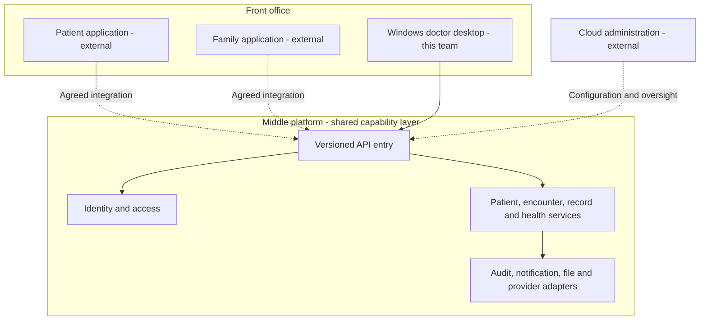
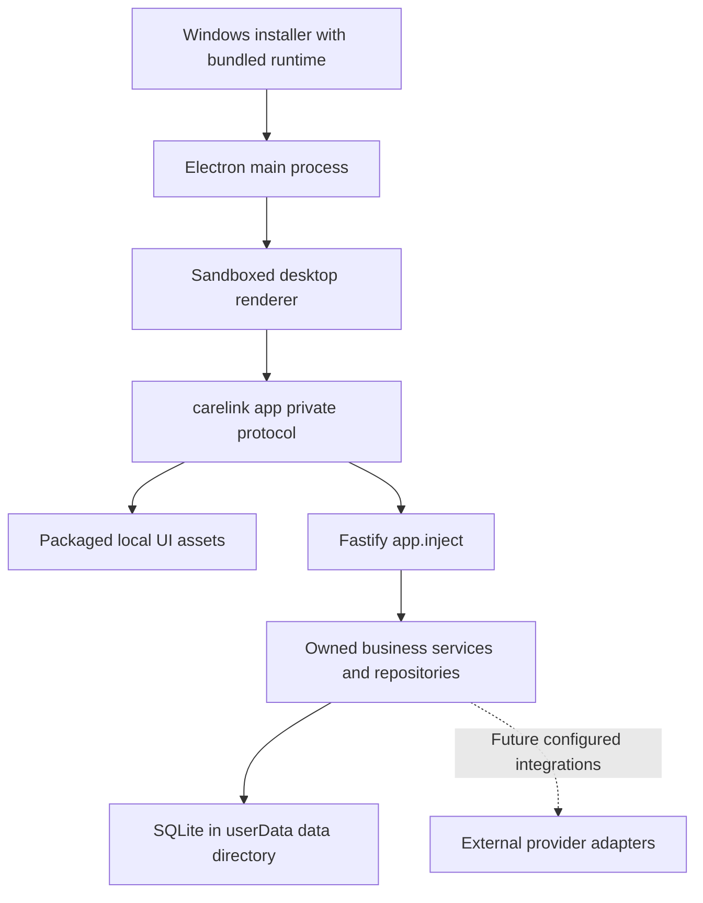
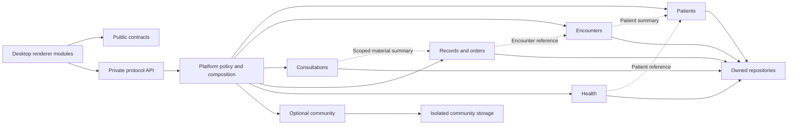
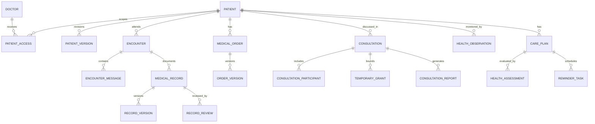
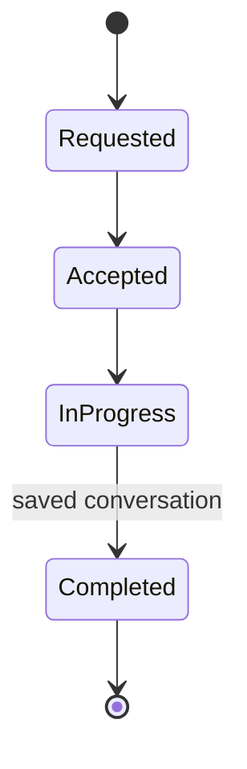
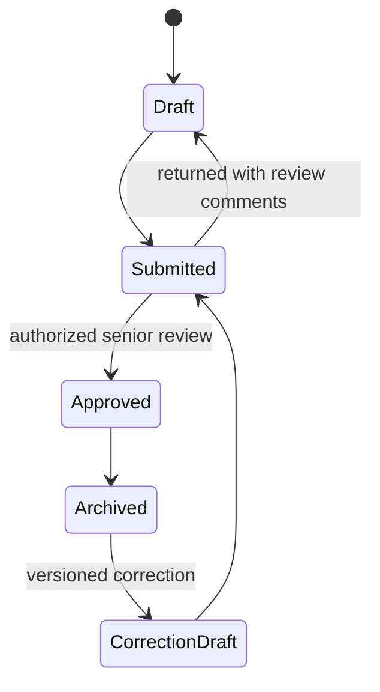

# Doctor Service System Architecture

The implementation is an installable Windows desktop application built with Electron and a TypeScript modular monolith. A sandboxed React renderer calls an embedded Fastify application through a private local protocol. The main process owns the database and service lifecycle. The installer bundles the runtime and assets, so users do not need Node.js, a separate browser or a database server. Domain contracts and repository boundaries keep five-person development independent.

The latest user instruction makes a Windows-installable desktop application and a persistent Chinese/English interface mandatory for Iteration 0. This supersedes the earlier browser-delivery assumption; the original Word/PPT sources remain unchanged historical inputs.

The framework currently demonstrates synthetic read-only data. Identity, clinical writes, real messaging, video, recordings, uploads, exports and external health-data ingestion are future work. Database tables, DTOs, provider ports and visible placeholders prepare those features; they do not establish production readiness.

## Platform boundary

The source requirements distinguish a front office, a middle platform and cloud administration. These are responsibilities, not a requirement to deploy three servers or to build three separate user interfaces in this team.



This repository implements the doctor application and the subset of shared services needed to support it. An administrator configures roles and platform policy; an appropriately authorized senior physician reviews clinical records. Those powers are not interchangeable. Cross-institution data sharing, the patient application's consent interface and platform-wide administration require coordination with the corresponding system owners.

## Desktop runtime and repository structure

| Part                         | Choice                                                                 | Responsibility                                                                              |
| ---------------------------- | ---------------------------------------------------------------------- | ------------------------------------------------------------------------------------------- |
| Installer and desktop shell  | Electron, Windows 10/11 x64, NSIS installer                            | Bundle runtime/assets, own windows and process lifecycle, provide installed launch behavior |
| Renderer                     | React, TypeScript and Vite build                                       | Light doctor workspace, owned domain pages and bilingual presentation                       |
| Private transport            | `carelink://app/` protocol                                             | Serve local assets; route `/api/v1` requests to embedded Fastify through `app.inject`       |
| Business services            | Embedded Fastify modular API                                           | Validate requests, coordinate owned repositories and preserve the existing DTO boundary     |
| Shared boundary              | `packages/contracts`                                                   | DTOs, envelopes, errors and provider interfaces; no UI/runtime implementation dependency    |
| Persistence                  | `node:sqlite` in the embedded runtime                                  | Migrations and synthetic data in `userData/data/doctor.sqlite`                              |
| Tooling                      | npm workspaces; developer Node.js 24.14+ in the 24.x line              | Reproducible source build; Node.js is not an end-user prerequisite                          |
| Future remote data           | Authenticated service and PostgreSQL adapter when required             | Reuse contracts while adding network authentication, migration and parity tests             |
| Future external capabilities | Storage, identity, RTC/recording, notifications, hospital/device ports | Credentials and provider logic remain outside the renderer                                  |



Desktop startup opens no TCP listener and requires no localhost browser tab. The protocol is an internal transport for the same versioned route contracts. A shared composition root creates the API once, owns its shutdown and closes database handles when the application exits. Renderer sandboxing, context isolation, disabled Node integration and controlled navigation form the desktop boundary. No generic filesystem, shell execution or unrestricted IPC bridge should be exposed to a domain screen.

```text
Industrial Team Project/
  apps/
    desktop/              Main process, private protocol, lifecycle and packaging
    web/                  React renderer, shared shell and owned feature modules
    api/                  Embedded Fastify domains, migrations and repositories
  packages/
    contracts/            Public DTOs and provider ports
  docs/                   English guides, plan, decisions and inactive CI template
  scripts/                Build and verification helpers
  release/                Generated installers and unpacked application, ignored by Git
```

Use the existing `Industrial Team Project` repository. No second source tree is needed. `apps/web` remains the renderer source directory; its name does not mean the user must run a website. `npm run dev:web` retains a loopback browser development option for renderer debugging. Normal launch and packaging target `apps/desktop`.

### Startup and data locations

End users install `CareLink-Doctor-0.2.0-Windows-x64-Setup.exe` and open CareLink Doctor from a Windows shortcut. Developers run `npm ci`, `npm run build`, then `npm start` from the repository root. The build creates renderer/API/desktop output; Electron loads those packaged assets. `npm run package:dir` prepares an unpacked Windows application and `npm run package:win` prepares the NSIS installer under `release/`.

The desktop database is `data/doctor.sqlite` under Electron's `userData` directory, within the current Windows user's profile. It is separate from the installation and source directory. Preferences belong to the application profile and survive restarts. An ordinary uninstall is configured to preserve application data; explicit profile removal is a separate user operation.

The optional browser development server uses the repository's `runtime/data/doctor.sqlite` by default, with `PORT`/`DATABASE_PATH` tooling configuration. Those development paths are not the installed application's data paths. Node's SQLite implementation remains behind repository code. Moving to PostgreSQL still requires SQL/transaction mapping, data migration and tests; it is not a configuration-only change.

### Chinese and English presentation

Supported locales are `zh-CN` and `en`; the first-run default is `zh-CN`. A top-bar control and Settings control share a persistent locale preference. Changing it updates visible text immediately and preserves the selection across a desktop restart. The current module source text supplies message keys, with English translations kept in domain-owned catalogs. A owns the locale provider, persistence, formatting helpers and shared shell messages. B–E own translations and localization tests for their modules.

Use `Intl` date/number formatting for presentation. API paths, machine error codes, enum values and resource IDs remain locale-neutral. Translate a status at the UI boundary, never by rewriting stored business values. Patient-authored/clinician-authored content keeps its original text. Demo content may have curated English equivalents, but the application must not silently translate real clinical content. Missing translations need an explicit fallback and test coverage rather than an empty label. Each feature's acceptance includes both locales, long English labels, dialogs and failure states.

## Domain ownership and allowed dependencies

| Owner | Module        | Owns                                                                                                                              | Public interface consumed by others                                              |
| ----- | ------------- | --------------------------------------------------------------------------------------------------------------------------------- | -------------------------------------------------------------------------------- |
| A     | Platform      | Desktop lifecycle/packaging, locale infrastructure, identity/session, access policy, audit, configuration, provider wiring, shell | Actor context, authorize operation, append audit, feature capability/read status |
| B     | Patients      | Patient profile, history/allergies, grouping and versions                                                                         | Scoped patient lookup, summary DTO, patient reference validation                 |
| C     | Encounters    | Requests, messages, attachments, media references, encounter state/history                                                        | Encounter summary and completed-encounter reference                              |
| C     | Consultations | Expert tasks, participants, temporary access relationship, materials and report drafts                                            | Consultation/task status; events used to revoke task grants                      |
| D     | Records       | Templates, EMR versions, review/archive, independent order versions/state                                                         | Scoped record/material summaries and archived version references                 |
| E     | Health        | Observations/provenance, plans, assessments, reminders                                                                            | Scoped health summaries, job requests, plan references                           |
| E     | Community     | Optional groups, discussions, social messages and reports                                                                         | Community-only interfaces and notification preferences                           |



Composition injects dependencies; domain code must not discover dependencies by importing another domain's database implementation. A service may call another module's exported read facade with the same authorization context. One module owns every write. Foreign-key references identify related objects without transferring write ownership. The dashboard is a read composition of public summaries, not a second owner of clinical data.

Domain components keep their styles local and use shared tokens. Public contract additions go through compatible exports. Type checking detects many mistakes during development. The current API validates patient query/path inputs and tests response envelopes. Add runtime request/response schemas and consumer contract tests as real writes and independently deployed consumers are introduced.

## Data model and storage responsibilities

The framework initializes schema for current previews and anticipated workflows. The following is the target domain model; a reserved table is not evidence of completed create/edit functionality. Inspect the committed migration files for exact current table and column names.



All clinical resources carry stable IDs and patient references where applicable. Versioned changes retain author, timestamp, reason and previous version. Observations retain measured time, received time, unit, source and external identifier for deduplication. The target audit model references actor, action, target, time, result and request correlation. Current audit rows contain actor/action/target/time/result/description; request correlation is currently available in the HTTP envelope and must be added to persisted audit metadata before live operation. File metadata records ownership, patient/task context, content type, length, storage key and access policy; storage keys are not public authorization credentials.

Production writes that change state and schedule work must commit business state and an outbox/task record in one transaction. A worker claims durable jobs and retries with an idempotency key. Consumers deduplicate by event ID. If a task becomes inaccessible while an export is waiting, the worker rechecks authorization before producing or releasing it. These mechanisms are planned; the scaffold has no operational notification worker.

Schema migrations are append-only once shared. Each domain owns its migration content and repository. A shared migration runner applies them in a deterministic order. Migration and backup tests are required before any real deployment upgrade.

## Workflow rules

### Encounter and medical record



The current preview DTO uses a reduced display vocabulary. Full workflow transitions must be explicitly added to the contract before enabling write operations. Automatic saving means a persisted result acknowledged by the server, with visible retry/failure state; a local success message alone is insufficient.



Archived versions remain available for traceability. A correction creates a new version under the agreed review policy. Medical orders have their own create/revise/stop lifecycle and history. Archiving an EMR does not automatically stop orders; stopping an order does not archive the record. Order validation rules need approved terminology and clinical review before live use.

### Expert consultation and access

Request/invite → scope patient materials → admit permitted experts → communicate → compile report draft → responsible doctor confirms → close task → revoke task access. Generated reports summarize supplied discussion/findings. The requirement does not authorize an autonomous diagnostic system.

### Health management

Validate patient/device input → normalize and preserve source/time → display trends → doctor assesses → revise plan → schedule reminders → record delivery result. Clinical alerts and monitoring thresholds need a validated policy. The framework's numbers and alert cards are synthetic examples, not medical conclusions or emergency monitoring.

## Authorization and privacy design

The eventual access rule is:

```text
authenticated actor
AND role permits the requested action
AND patient/institution authorization permits the requested data scope
AND (when temporary access is used:
     grant permits the action and scope
     AND grant is not revoked
     AND current time is before expiry
     AND the consultation task remains active)
```

Check this rule on the server for list/search, detail, mutation, upload, file download, export and live session admission. Lists must filter before counts and pagination to prevent data leakage. Bulk operations check every item. A revoked or expired grant must also stop access to media and ongoing sessions, using provider controls or an authorization gateway. A long-lived signed file URL alone cannot enforce immediate revocation; choose short-lived URLs with an accepted exposure window or proxy protected access when strict revocation is required.

The scaffold uses a fixed synthetic doctor and scoped synthetic data; it cannot authenticate a real caller. The desktop embeds services without a network listener and limits renderer access to its private protocol. The optional browser-development server separately binds to loopback and rejects non-local Host/external Origin requests. Packaging a desktop executable does not change demo mode into clinical production readiness. Any demonstration of scope or temporary-grant query logic is a development seam, not production session security. Demo mode must be replaced or strictly disabled before real records can be loaded.

Production deployment additionally needs reviewed session handling, transport security, secrets, storage protection, minimum necessary fields, audit access, backups and monitoring. Those are work items rather than guarantees. Ordinary doctors see their own audit entries; only separately authorized administrators receive platform-wide audit capabilities.

Community is optional and isolated. Do not publish clinical events to it, link posts to real patient records, or automatically prefill case content from the chart. Authors manually edit and de-identify any shared case and confirm it before posting. The community is for professional discussion and cannot issue a treatment plan for a specific patient. Disabling community must suppress server-generated social notifications as well as hiding the UI.

## Integration ports and failure behavior

| Port                    | Planned responsibility                                         | Failure or policy requirement                                                                  |
| ----------------------- | -------------------------------------------------------------- | ---------------------------------------------------------------------------------------------- |
| `IdentityProvider`      | Email/SMS/face challenges through an approved provider         | Fail closed; secrets remain server-side; selected MFA policy is configurable                   |
| `RtcProvider`           | Create/close authorized video rooms                            | Connection state, timeout, fallback and participant removal must be visible                    |
| `RecordingProvider`     | Start/stop recording with a consent reference                  | Recording requires agreed consent/defaults/retention; report failures and incomplete artifacts |
| `ObjectStorageProvider` | Authorized upload/download of documents, images and recordings | Validate type/size, recheck scope, expire access and remove orphan artifacts                   |
| `NotificationProvider`  | Deliver reminders and business/social messages                 | Persistent retries, idempotency, preference enforcement and provider receipt                   |
| `HospitalProvider`      | Import permitted hospital record references/versions           | Validate authorization, provenance, schema version and duplicate source IDs                    |
| `DeviceProvider`        | Retrieve authorized health observations                        | Validate patient mapping, source/time/units and out-of-order/duplicate readings                |

The interfaces are initial seams. Live RTC needs participant/token revocation, devices need broader provenance than `synthetic-demo`, and identity needs full session lifecycle contracts. Extend these interfaces compatibly with provider contract tests before selecting an adapter. No live provider is configured in Iteration 0.

## Reliability, Windows compatibility and growth

Deliver a self-contained Windows 10/11 x64 installer and verify the unpacked executable separately. Use cross-platform build helpers, but run Electron window/language/packaging verification on Windows. Test paths containing spaces and non-ASCII characters, first launch, close/reopen, persistent locale, persistent database and ordinary uninstall/reinstall behavior. Source installation and packaging may need internet access to download dependencies; the installed synthetic demonstration has no external asset dependency.

A owns desktop main-process lifecycle, protocol allowlists and packaging. Domain owners must not add direct Electron or Node imports to renderer pages. Future external links, camera/microphone access and file exports need purpose-specific desktop integration that respects user permission and server-side data scope. Packaging and application updates must preserve data-version compatibility and fail clearly on incompatible migration history.

Keep one embedded business application initially. A later networked clinical deployment can move business services behind an authenticated transport without redesigning domain screens or DTO meanings. Extract workers/services when measured workload and ownership justify it. Define recovery targets and prove backup restoration, access denial, retries and version history; a desktop package is not proof of reliability or clinical security.

Sources and interpretation decisions are recorded in [Requirement traceability](REQUIREMENTS_TRACEABILITY.md). Current route semantics are in [API conventions](API_CONVENTIONS.md); installation and build commands are in [Desktop guide](DESKTOP_GUIDE.md).
