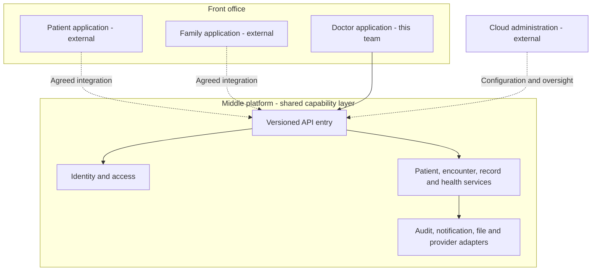
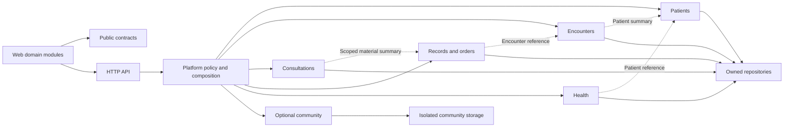
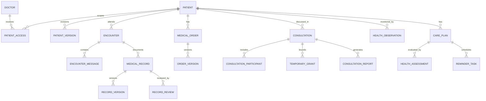
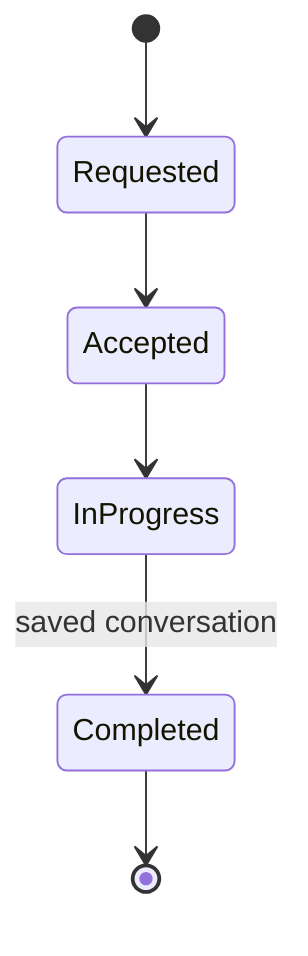
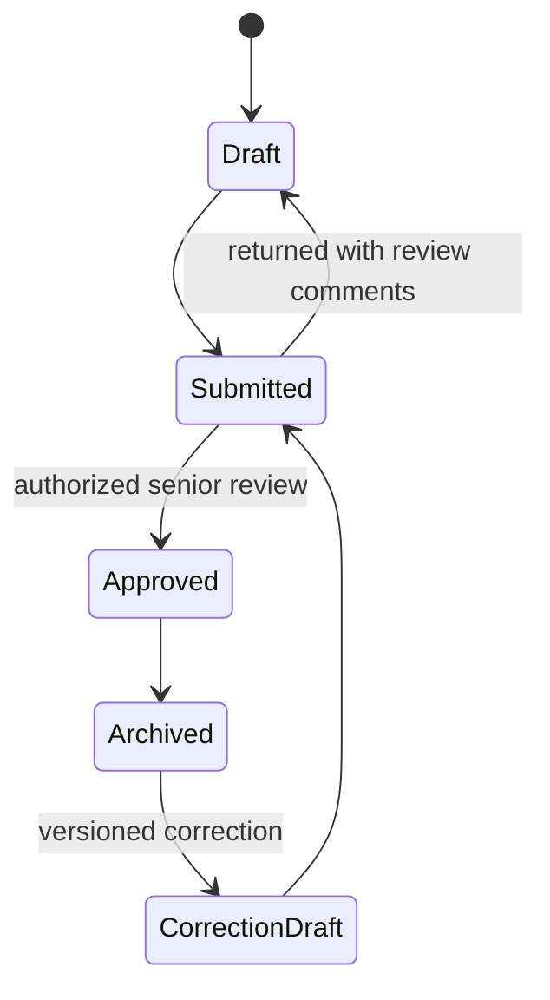

# Doctor Service System Architecture

The initial implementation is a TypeScript modular monolith: a React browser application calls a Fastify API, and the API owns a local SQLite database through repository code. It runs on Windows without Docker. This keeps local development practical for a five-person team while separating business domains, shared contracts, and external providers.

The framework currently demonstrates synthetic read-only data. Identity, clinical writes, real messaging, video, recordings, uploads, exports and external health-data ingestion are future work. Database tables, DTOs, provider ports and visible placeholders prepare those features; they do not establish production readiness.

## Platform boundary

The source requirements distinguish a front office, a middle platform and cloud administration. These are responsibilities, not a requirement to deploy three servers or to build three separate user interfaces in this team.



This repository implements the doctor application and the subset of shared services needed to support it. An administrator configures roles and platform policy; an appropriately authorized senior physician reviews clinical records. Those powers are not interchangeable. Cross-institution data sharing, the patient application's consent interface and platform-wide administration require coordination with the corresponding system owners.

## Runtime and repository structure

| Part                          | Initial choice                                                        | Purpose and extension point                                                              |
| ----------------------------- | --------------------------------------------------------------------- | ---------------------------------------------------------------------------------------- |
| Workspace                     | npm workspaces and a committed lockfile                               | One installation and consistent scripts for all members                                  |
| Browser UI                    | React, TypeScript and Vite                                            | Responsive light doctor workspace, feature modules and shared visual tokens              |
| API                           | Fastify 5 on Node.js 24.14 or later in the 24.x line                  | Versioned HTTP endpoints, validation, domain composition and provider injection          |
| Shared boundary               | `packages/contracts`                                                  | Public DTOs, response/error envelopes and integration interfaces                         |
| Local persistence             | Built-in `node:sqlite` with migrations and synthetic seed data        | No additional database server needed for the framework                                   |
| Future deployment persistence | PostgreSQL repository adapter when deployment requirements justify it | Preserve service interfaces; convert schema/query details and test migration parity      |
| Future files/media            | Object-storage and RTC/recording adapters                             | Store metadata/references in the database; large content belongs outside relational rows |
| Future background work        | Persistent jobs/outbox and workers                                    | Retries, deduplication, reminders and exports                                            |

```text
Industrial Team Project/
  apps/
    web/                  React client, shared shell and owned feature modules
    api/                  Fastify server, owned domain modules, migrations, repositories
  packages/
    contracts/            Public cross-module and browser/server interfaces
  docs/                   Plan, architecture, API and requirement decisions
  scripts/                Repository-level developer and verification helpers
```

Use the actual `Industrial Team Project` folder name. The misspelling `Industial Team Project` in the request does not require a second repository or duplicate source tree. The browser client calls `/api/v1` through the development proxy; a deployed setup should use an equivalent same-origin reverse proxy. Runtime URLs belong in configuration, not individual screens.

Node's SQLite implementation is a development convenience, not an abstraction that makes every database interchangeable. Repository methods contain queries; business services consume those methods. A PostgreSQL migration still needs compatible SQL, explicit transaction behavior, identifier/time mapping, data migration and tests. Do not place raw SQLite statements in UI components or business consumers.

### Current startup and file locations

Run commands from the repository root. `npm ci` installs the locked workspace dependencies; `npm run dev` starts the API on `127.0.0.1:3001` and Vite on `127.0.0.1:5173`. For a single local server, `npm run build` creates `apps/web/dist` and `apps/api/dist/server.js`, then `npm start` serves the built application on port 3001. `start-windows.cmd` provides the Windows launcher.

The default database is `runtime/data/doctor.sqlite`, relative to the repository root. `DATABASE_PATH` overrides that location; an absolute path remains absolute and other file paths resolve relative to the repository. Runtime files are excluded from Git. `PORT` changes the API port, but a development port change also needs the Vite proxy and test base URL to agree. Using the documented defaults avoids that coordination.

## Domain ownership and allowed dependencies

| Owner | Module        | Owns                                                                                   | Public interface consumed by others                                              |
| ----- | ------------- | -------------------------------------------------------------------------------------- | -------------------------------------------------------------------------------- |
| A     | Platform      | Identity/session, access policy, audit, configuration, provider wiring, shell          | Actor context, authorize operation, append audit, feature capability/read status |
| B     | Patients      | Patient profile, history/allergies, grouping and versions                              | Scoped patient lookup, summary DTO, patient reference validation                 |
| C     | Encounters    | Requests, messages, attachments, media references, encounter state/history             | Encounter summary and completed-encounter reference                              |
| C     | Consultations | Expert tasks, participants, temporary access relationship, materials and report drafts | Consultation/task status; events used to revoke task grants                      |
| D     | Records       | Templates, EMR versions, review/archive, independent order versions/state              | Scoped record/material summaries and archived version references                 |
| E     | Health        | Observations/provenance, plans, assessments, reminders                                 | Scoped health summaries, job requests, plan references                           |
| E     | Community     | Optional groups, discussions, social messages and reports                              | Community-only interfaces and notification preferences                           |



Composition injects dependencies; domain code must not discover dependencies by importing another domain's database implementation. A service may call another module's exported read facade with the same authorization context. One module owns every write. Foreign-key references identify related objects without transferring write ownership. The dashboard is a read composition of public summaries, not a second owner of clinical data.

Domain components keep their styles local and use shared tokens. Public contract additions go through compatible exports. Type checking detects many mistakes during development. The current API validates patient query/path inputs and tests response envelopes. Add runtime request/response schemas and consumer contract tests as real writes and independently deployed consumers are introduced.

## Data model and storage responsibilities

The framework initializes schema for current previews and anticipated workflows. The following is the target domain model; a reserved table is not evidence of completed create/edit functionality. Inspect the committed migration files for exact current table and column names.



All clinical resources carry stable IDs and patient references where applicable. Versioned changes retain author, timestamp, reason and previous version. Observations retain measured time, received time, unit, source and external identifier for deduplication. The target audit model references actor, action, target, time, result and request correlation. Current audit rows contain actor/action/target/time/result/description; request correlation is currently available in the HTTP envelope and must be added to persisted audit metadata before live operation. File metadata records ownership, patient/task context, content type, length, storage key and access policy; storage keys are not public authorization credentials.

Production writes that change state and schedule work must commit business state and an outbox/task record in one transaction. A worker claims durable jobs and retries with an idempotency key. Consumers deduplicate by event ID. If a task becomes inaccessible while an export is waiting, the worker rechecks authorization before producing or releasing it. These mechanisms are planned; the scaffold has no operational notification worker.

Schema migrations are append-only once shared. Each domain owns its migration content and repository. A shared migration runner applies them in a deterministic order. Migration and backup tests are required before any real deployment upgrade.

## Workflow rules

### Encounter and medical record



The current preview DTO uses a reduced display vocabulary. Full workflow transitions must be explicitly added to the contract before enabling write operations. Automatic saving means a persisted result acknowledged by the server, with visible retry/failure state; a local success message alone is insufficient.



Archived versions remain available for traceability. A correction creates a new version under the agreed review policy. Medical orders have their own create/revise/stop lifecycle and history. Archiving an EMR does not automatically stop orders; stopping an order does not archive the record. Order validation rules need approved terminology and clinical review before live use.

### Expert consultation and access

Request/invite → scope patient materials → admit permitted experts → communicate → compile report draft → responsible doctor confirms → close task → revoke task access. Generated reports summarize supplied discussion/findings. The requirement does not authorize an autonomous diagnostic system.

### Health management

Validate patient/device input → normalize and preserve source/time → display trends → doctor assesses → revise plan → schedule reminders → record delivery result. Clinical alerts and monitoring thresholds need a validated policy. The framework's numbers and alert cards are synthetic examples, not medical conclusions or emergency monitoring.

## Authorization and privacy design

The eventual access rule is:

```text
authenticated actor
AND role permits the requested action
AND patient/institution authorization permits the requested data scope
AND (when temporary access is used:
     grant permits the action and scope
     AND grant is not revoked
     AND current time is before expiry
     AND the consultation task remains active)
```

Check this rule on the server for list/search, detail, mutation, upload, file download, export and live session admission. Lists must filter before counts and pagination to prevent data leakage. Bulk operations check every item. A revoked or expired grant must also stop access to media and ongoing sessions, using provider controls or an authorization gateway. A long-lived signed file URL alone cannot enforce immediate revocation; choose short-lived URLs with an accepted exposure window or proxy protected access when strict revocation is required.

The scaffold uses a fixed synthetic doctor and scoped synthetic data; it cannot authenticate a real caller. Its server binds to loopback, rejects non-local Host/external Origin requests, and refuses `NODE_ENV=production`. Any demonstration of scope or temporary-grant query logic is a development seam, not production session security. Demo mode must be replaced or strictly disabled before real records can be loaded.

Production deployment additionally needs reviewed session handling, transport security, secrets, storage protection, minimum necessary fields, audit access, backups and monitoring. Those are work items rather than guarantees. Ordinary doctors see their own audit entries; only separately authorized administrators receive platform-wide audit capabilities.

Community is optional and isolated. Do not publish clinical events to it, link posts to real patient records, or automatically prefill case content from the chart. Authors manually edit and de-identify any shared case and confirm it before posting. The community is for professional discussion and cannot issue a treatment plan for a specific patient. Disabling community must suppress server-generated social notifications as well as hiding the UI.

## Integration ports and failure behavior

| Port                    | Planned responsibility                                         | Failure or policy requirement                                                                  |
| ----------------------- | -------------------------------------------------------------- | ---------------------------------------------------------------------------------------------- |
| `IdentityProvider`      | Email/SMS/face challenges through an approved provider         | Fail closed; secrets remain server-side; selected MFA policy is configurable                   |
| `RtcProvider`           | Create/close authorized video rooms                            | Connection state, timeout, fallback and participant removal must be visible                    |
| `RecordingProvider`     | Start/stop recording with a consent reference                  | Recording requires agreed consent/defaults/retention; report failures and incomplete artifacts |
| `ObjectStorageProvider` | Authorized upload/download of documents, images and recordings | Validate type/size, recheck scope, expire access and remove orphan artifacts                   |
| `NotificationProvider`  | Deliver reminders and business/social messages                 | Persistent retries, idempotency, preference enforcement and provider receipt                   |
| `HospitalProvider`      | Import permitted hospital record references/versions           | Validate authorization, provenance, schema version and duplicate source IDs                    |
| `DeviceProvider`        | Retrieve authorized health observations                        | Validate patient mapping, source/time/units and out-of-order/duplicate readings                |

The interfaces are initial seams. Live RTC needs participant/token revocation, devices need broader provenance than `synthetic-demo`, and identity needs full session lifecycle contracts. Extend these interfaces compatibly with provider contract tests before selecting an adapter. No live provider is configured in Iteration 0.

## Reliability, Windows compatibility and growth

Keep local startup dependent only on the documented Node/npm version and a browser. Use cross-platform Node scripts and documented environment variables rather than Bash-only commands. The current server reads `PORT` and `DATABASE_PATH`; it does not automatically load an `.env` file. Verify Windows paths containing spaces and non-ASCII characters. Development needs internet access to install dependencies; configured external services require network access in later iterations. Read-only local demonstrations should remain usable when providers are absent.

Start with one API deployment. Extract a worker or service only when measured workload or operational ownership warrants it, preserving the existing public interfaces. Avoid promising zero data loss or absolute confidentiality: define recovery targets and prove backup restoration, access denial, idempotent retries, and version history with tests. The iteration plan identifies where those checks become release gates.

Sources and interpretation decisions are recorded in [Requirement traceability](REQUIREMENTS_TRACEABILITY.md). Exact current HTTP interfaces are described in [API conventions](API_CONVENTIONS.md).
